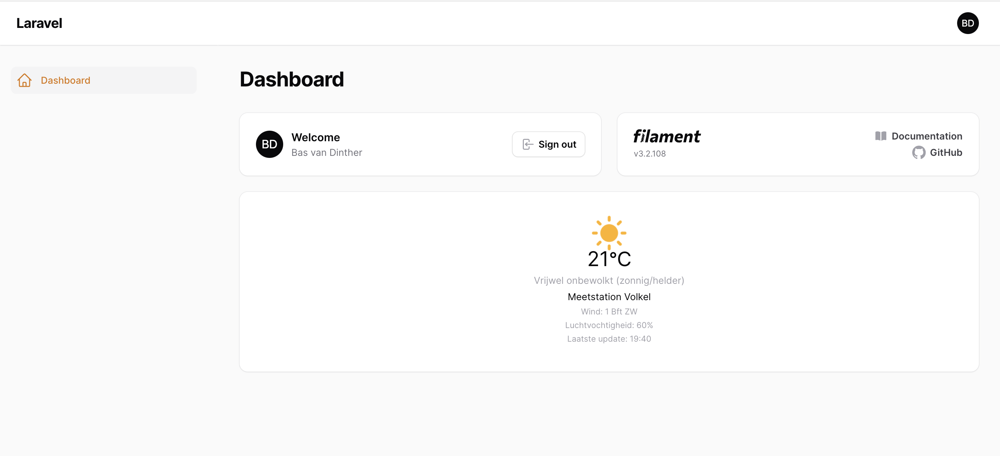
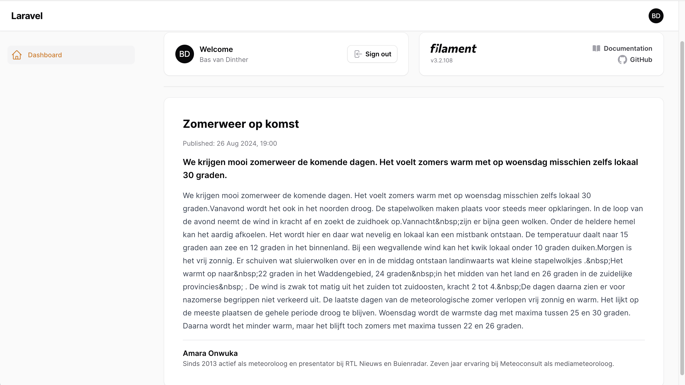

# Filament Buienradar Widget

[](https://packagist.org/packages/baspa/filament-buienradar-widget)
[](https://github.com/baspa/filament-buienradar-widget/actions?query=workflow%3Arun-tests+branch%3Amain)
[](https://github.com/baspa/filament-buienradar-widget/actions?query=workflow%3A"Fix+PHP+code+styling"+branch%3Amain)
[](https://packagist.org/packages/baspa/filament-buienradar-widget)

This package provides a Filament widget to show the Dutch forecast from [Buienradar](https://www.buienradar.nl/). The package is based on the [Buienradar PHP package](https://github.com/Baspa/buienradar-php-api).

## Installation

You can install the package via composer:

```bash
composer require baspa/filament-buienradar-widget
```

You can publish the config file with:

```bash
 php artisan vendor:publish --tag="buienradar-widget-config"
```

Optionally, you can publish the views using

```bash
php artisan vendor:publish --tag="buienradar-widget-views"
```

This is the contents of the published config file:

```php
return [
    'station' => MeasuringStation::VOLKEL,
    'show' => [
        'temperature' => true,
        'weather_description' => true,
        'wind_speed' => true,
        'stationname' => true,
        'humidity' => true,
        'last_update' => true,
    ],
];
```

To check what stations are available, you can check the `MeasuringStation` enum in the Buienradar package.

## Usage

Add the widget to your Filament page via your provider:

```php
use Baspa\FilamentBuienradarWidget\Widgets\FilamentBuienradarWidgetPlugin;

// ...

->plugin(FilamentBuienradarWidgetPlugin::make())
```

And optionally add the widgets to your page:

```php
use Baspa\FilamentBuienradarWidget\Widgets\ForecastReportWidget;
use Baspa\FilamentBuienradarWidget\Widgets\ForecastLongTermWidget;
use Baspa\FilamentBuienradarWidget\Widgets\ForecastShortTermWidget;
use Baspa\FilamentBuienradarWidget\Widgets\ForecastForStationWidget;

// ...

public function getHeaderWidgetsColumns(): int
{
    return 12;
}

public function getHeaderWidgets(): array
{
    return [
        ForecastForStationWidget::make([
            'width' => 4, // Define the width of the widget
        ]),
        ForecastShortTermWidget::make([
            'width' => 4,
        ]),
        ForecastLongTermWidget::make([
            'width' => 4,
        ]),
        ForecastReportWidget::make([
            'width' => 12,
        ]),
    ];
}
```

### Forecast for station



#### Set the station per widget

To set the station per widget, you can pass the station in the widget. This will override the station set in the config.

```php
use Baspa\Buienradar\Enum\MeasuringStation;

// ...

ForecastForStationWidget::make([
    'station' => MeasuringStation::VOLKEL,
])
```

### Forecast report



### Forecast short term


### Forecast long term


## Testing

```bash
composer test
```

## Changelog

Please see [CHANGELOG](CHANGELOG.md) for more information on what has changed recently.

## Contributing

Please see [CONTRIBUTING](.github/CONTRIBUTING.md) for details.

## Security Vulnerabilities

Please review [our security policy](../../security/policy) on how to report security vulnerabilities.

## Credits

-   [Baspa](https://github.com/Baspa)
-   [All Contributors](../../contributors)

## License

The MIT License (MIT). Please see [License File](LICENSE.md) for more information.
